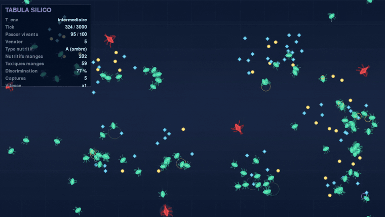
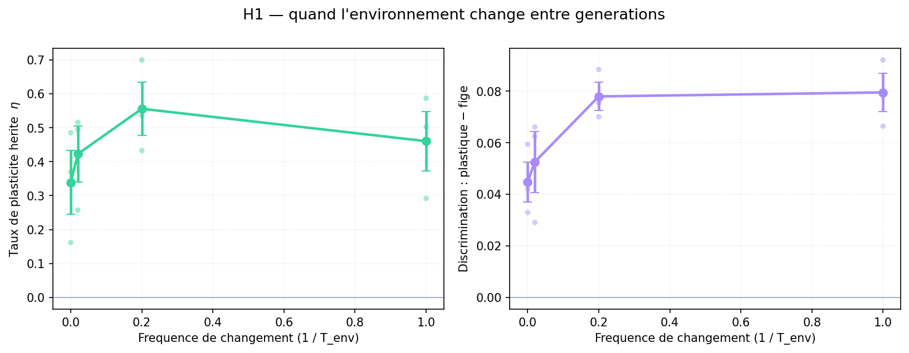
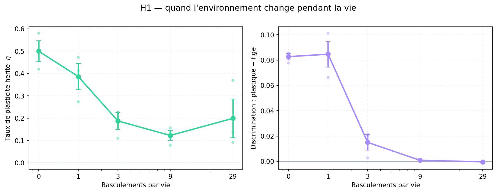
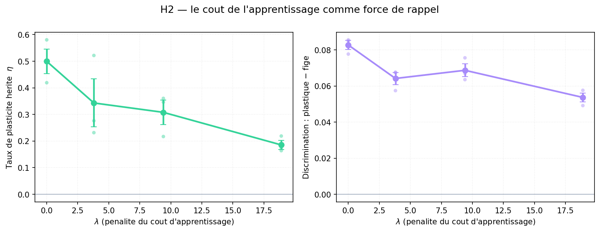
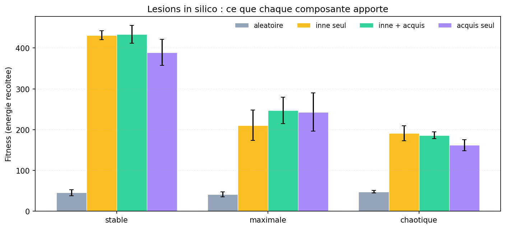

# Tabula Silico

*Une simulation de vie artificielle sur l'origine du comportement : quelle part revient à l'inné, quelle part revient à l'acquis, et qu'est-ce qui décide de leur répartition ?*



Les **Pascor** (vert, corps arrondi) cherchent de la nourriture ; les **Venator** (rouge, corps anguleux) les chassent. Deux types d'aliments — pastilles ambre et losanges cyan — dont l'un est nutritif et l'autre toxique. Rien dans leur apparence ne dit lequel : c'est ce que l'agent doit avoir hérité, ou apprendre.

Sur cette capture, la discrimination atteint 77 % et les pastilles ambre (nutritives ici) sont visiblement plus rares que les losanges cyan : les agents mangent les unes et laissent les autres. La stratégie alimentaire se lit directement dans ce qui reste au sol.

---

## En bref

Des agents virtuels doivent trouver de la nourriture et éviter un prédateur dans un monde 2D. Deux types d'aliments existent ; l'un est nutritif, l'autre toxique — et lequel l'est change au fil du temps. Chaque agent porte un gène, **η**, qui détermine dans quelle mesure son comportement est câblé dès la naissance ou façonné par son expérience. Ce gène est hérité, donc soumis à la sélection naturelle.

La question n'est pas *« l'inné ou l'acquis ? »*, faux dilemme tranché depuis longtemps, mais : **dans quelles conditions la sélection favorise-t-elle l'un ou l'autre, et que gagne-t-on à les combiner ?**

Résultat principal, en une phrase : la sélection abandonne l'apprentissage dans **trois** situations distinctes — quand l'environnement est trop stable (rien à apprendre), quand il change trop vite (impossible d'apprendre), et quand apprendre coûte trop cher (pas rentable).

---

## Contexte scientifique

En 1689, dans son *Essai sur l'entendement humain*, John Locke avance que l'esprit naît comme une *tabula rasa* — une table rase sur laquelle seule l'expérience viendra écrire. Trois siècles de biologie évolutive ont nuancé cette image : aucun organisme ne naît vierge. Un poussin se fige devant une ombre qui passe, une larve sait nager. Mais aucun n'est non plus un automate figé : l'apprentissage existe, et confère un avantage réel dans un monde qui change.

La théorie prédit que l'apprentissage n'est favorisé que dans une **fenêtre intermédiaire de variabilité environnementale** (Stephens 1991) : l'environnement doit changer assez pour que l'information héritée devienne obsolète, mais rester assez stable pendant une vie pour que ce qu'on apprend serve encore. Et l'apprentissage a un coût — temps, erreurs, risque pendant la phase d'essai (Johnston 1982, Dukas 1998).

Ce cadre est solide mais rarement testé dans un agent **situé** : un agent qui doit réellement se déplacer, se nourrir et survivre dans un espace, plutôt que dans un modèle mathématique abstrait. C'est ce que fait Tabula Silico.

---

## Les protagonistes

**Pascor** (*pascor*, « je me nourris ») est un herbivore, le sujet d'étude. Il perçoit son environnement par cinq secteurs de vision, sur trois canaux distincts (aliment de type A, de type B, prédateur), plus son niveau d'énergie. Un réseau de neurones évolué par NEAT contrôle sa rotation, sa poussée et sa **décision d'ingérer**.

**Venator** (« le chasseur ») est un carnivore. Il n'évolue pas et n'apprend pas : c'est une pression de sélection, pas un second sujet d'étude. Le faire coévoluer aurait fait varier la difficulté de l'environnement indépendamment des axes expérimentaux, et les aurait confondus.

Aucun des deux ne représente une espèce réelle. Ce sont des organismes génériques, dans la tradition de l'*optimal foraging theory*, choisis pour ne pas prétendre modéliser une biologie que la simulation ne capture pas.

---

## Le dispositif

### Ce que l'agent doit apprendre

Deux types d'aliments, perceptivement distincts (pastilles ambre et losanges cyan, canaux sensoriels séparés). À chaque changement d'environnement, l'un devient nutritif (+25 énergie) et l'autre toxique (−10), et **lequel s'inverse**. Rien dans l'apparence n'indique lequel est comestible.

- **Stratégie innée** : une préférence fixe, héritée. Gagne si l'environnement est stable, devient létale s'il s'inverse.
- **Stratégie acquise** : goûter, subir la conséquence, ajuster.

Trois propriétés rendent ce dispositif adapté :

1. **Le signal de renforcement est intrinsèque** — le gain ou la perte d'énergie *est* le signal d'apprentissage. Rien d'artificiel à inventer.
2. **Le coût de l'apprentissage est intrinsèque** — pour découvrir quel type est bon, il faut goûter le mauvais et le payer.
3. **C'est de l'éthologie réelle** — l'aversion gustative conditionnée (effet Garcia) est un phénomène documenté.

### Le curseur inné/acquis

Chaque Pascor porte une **préférence alimentaire** explicite, un scalaire par type, qui pondère sa décision d'ingérer.

| | |
|---|---|
| **Inné** | la valeur initiale de ces préférences, encodée dans le génome, héritée |
| **Acquis** | leur mise à jour au cours de la vie, par expérience directe. Meurt avec l'individu |
| **η** | le taux de cette mise à jour, hérité, **soumis à la sélection** |

Le point central : on ne décide pas si Pascor apprend. La sélection en décide, et c'est ce qu'on mesure.

### Les deux axes de volatilité

| Axe | Paramètre | Ce qu'il teste |
|---|---|---|
| **Entre générations** | `T_env` | Branche **montante** : l'inné devient obsolète, la plasticité gagne |
| **Pendant la vie** | `v_vie` | Branche **descendante** : ce qu'on apprend devient obsolète avant de servir |

### La mesure : double évaluation

Chaque génération, **le même génome est évalué deux fois** dans des mondes identiques :

- **P_naïf** : plasticité gelée dès la naissance — mesure pure de l'inné
- **P_libre** : plasticité active — inné + acquis
- **ΔP = P_libre − P_naïf** — ce que l'apprentissage apporte

---

## Résultats

Un run = un point de donnée indépendant. Les individus d'un même run partagent une histoire évolutive et ne sont pas indépendants entre eux ; les agréger comme s'ils l'étaient serait de la pseudo-réplication (Hurlbert 1984). Les 20 premières générations sont écartées : avant cela, les réseaux ne savent pas encore fourrager (~4 repas par vie, contre ~25 après).

### H1 — branche montante : quand l'environnement change entre générations



| Volatilité (1/T_env) | η final | Écart discrimination plastique − figé |
|---|---|---|
| stable (0) | 0,339 | +0,045 |
| faible (0,02) | 0,423 | +0,053 |
| **forte (0,20)** | **0,556** | +0,078 |
| maximale (1,0) | 0,461 | **+0,080** |

**L'avantage de la plasticité croît avec la volatilité : ρ = +0,820, p = 0,0011.** Plus l'environnement change, plus l'apprentissage apporte un gain réel — le mécanisme de la branche montante est établi.

**Mais la réponse évolutive de η n'est pas significative** : ρ = +0,453, **p = 0,139**, avec une dispersion importante entre graines (0,70 / 0,54 / 0,43 à `forte`). La tendance est croissante, mais trois graines ne suffisent pas à l'affirmer.

Un détail qui oriente les réplications futures : le maximum de η est à `forte` (0,556) et non à `maximale` (0,461) — ce qui serait précisément l'optimum intermédiaire prédit par Stephens. Le signal est trop bruité pour l'affirmer, mais il désigne où chercher.

Cette branche est donc **moins solidement établie que la descendante**, et le README l'indique plutôt que de la présenter comme acquise.

### H1 — branche descendante : quand l'environnement change pendant la vie



| Basculements / vie | η final | Écart discrimination plastique − figé |
|---|---|---|
| 0 | 0,499 | +0,083 |
| 1 | 0,386 | +0,085 |
| **3** | **0,187** | **+0,015** |
| 9 | 0,123 | +0,001 |
| 29 | 0,199 | −0,000 |

**ρ = −0,764, p = 0,0009** pour η ; **ρ = −0,917, p < 0,0001** pour l'écart de discrimination. Contraste extrême : d de Cohen = **2,51**. (n = 15 runs, 5 niveaux × 3 graines.)

La transition est franche, entre 1 et 3 basculements. Avec ~20 repas par vie, un basculement laisse une dizaine de dégustations pour réapprendre ; trois n'en laissent que cinq. Le seuil se situe là où le nombre d'occasions d'apprendre tombe sous ce qu'exige l'apprentissage — le résultat est donc quantifiable, pas seulement descriptif.

À 29 basculements, η remonte légèrement, avec une dispersion très forte entre graines (0,37 / 0,14 / 0,09). C'est cohérent avec un **gène devenu neutre** : quand la plasticité ne sert plus à rien, η n'est plus sous sélection et dérive librement.

### H2 — le coût de l'apprentissage



| λ | Coût ≈ | η final | Écart discrimination |
|---|---|---|---|
| 0 | — | 0,499 | +0,083 |
| 3,8 | 10 % | 0,343 | +0,064 |
| 9,4 | 25 % | 0,308 | +0,069 |
| 18,9 | 50 % | 0,185 | +0,054 |

**ρ = −0,820, p = 0,0011.** d de Cohen = **5,18**. (n = 12 runs.)

Un point qui compte pour l'interprétation : l'écart de discrimination reste **positif partout** (+0,054 même au coût maximal). La plasticité continue de fonctionner — elle rend toujours l'agent meilleur — mais la sélection l'abandonne parce qu'elle ne vaut plus son prix. C'est exactement le mécanisme décrit par Johnston et Dukas : ce n'est pas que l'apprentissage cesse de marcher, c'est qu'il cesse d'être rentable.

Les valeurs de λ ne sont pas arbitraires : elles ont été calibrées pour représenter 10 %, 25 % et 50 % de la fitness typique, mesurée sur la condition de référence (F = 234,8, coût réalisé C = 6,21, λ = fraction × F / C).

### H3 — la répartition inné/acquis dépend de l'environnement



Quatre conditions appliquées à une population **évoluée**, même génome partout, seul change ce qu'on lui permet d'utiliser :

| Condition | stable | maximale | chaotique |
|---|---|---|---|
| aléatoire (ni hérité ni appris) | 45,8 | 41,7 | 47,9 |
| inné seul | 431,3 | 210,8 | 191,4 |
| inné + acquis | 433,5 | 246,9 | 186,2 |
| acquis seul (préférences innées effacées) | 389,0 | 243,2 | 161,9 |

**3a — le socle inné est fonctionnel** : 277,8 contre 45,1 pour des génomes non évolués, **p = 0,0002**.

**3b — l'apprentissage n'apporte un gain que là où il est utile** : ΔP = +36,1 en `maximale` (trois graines positives : +43, +27, +38), contre +2,2 en `stable` et −5,2 en `chaotique`. Mann-Whitney maximale vs autres : p = 0,083.

**Le résultat le plus fort — effacer l'inné :**

| Condition | Coût de la lésion |
|---|---|
| stable | **−42,3** |
| maximale | **+32,4** |
| chaotique | −29,5 |

Mann-Whitney maximale vs stable : **p = 0,050**.

En environnement stable, effacer les préférences innées coûte cher : elles y encodent une information correcte. En environnement maximalement volatil, les effacer **améliore** la performance — une préférence héritée y a une chance sur deux d'être fausse, et une préférence fausse est activement nuisible. L'agent s'en sort mieux en partant de zéro.

C'est H3 dans sa forme forte : non seulement les deux composantes contribuent, mais **laquelle porte l'information bascule avec l'environnement**.

---

## Synthèse

Trois chemins distincts mènent à l'inné, chacun par un mécanisme identifié séparément :

| Situation | Pourquoi l'inné gagne | Preuve |
|---|---|---|
| Environnement stable | Rien à apprendre : l'inné encode déjà la bonne réponse (discrimination innée 0,743) | Lésion de l'inné coûte −42,3 |
| Changement trop rapide | Impossible d'apprendre : l'acquis devient obsolète avant de servir | η : 0,499 → 0,123 |
| Apprentissage coûteux | Pas rentable, bien que toujours efficace | η : 0,499 → 0,185 |

Aucun de ces trois résultats ne peut s'expliquer par un artefact commun aux trois — c'est cette convergence par des voies indépendantes qui donne du poids à l'ensemble.

---

## Limites

**Réplication.** Trois graines par condition. C'est assez pour distinguer un effet réel d'une dérive, mais peu pour la statistique : avec n = 3, un test des signes ne peut pas descendre sous p = 0,125, ce qui plafonne mécaniquement H3b (p = 0,083 malgré trois graines concordantes). C'est un problème de puissance, pas de signal.

**La branche montante de H1 est moins solide que la descendante.** L'avantage de la plasticité croît nettement avec la volatilité inter-générationnelle (p = 0,001), mais la réponse de η n'atteint pas le seuil de significativité sur trois graines (p = 0,139). Une réplication plus large est nécessaire, notamment pour trancher si le maximum de η se situe bien à volatilité intermédiaire — ce que suggèrent les données sans le démontrer.

**Reproductibilité.** Jusqu'à une correction tardive, seul le générateur de numpy était initialisé par la graine ; le module `random` utilisé par neat-python et par les mutations de η ne l'était pas. Les runs antérieurs à cette correction ne sont donc pas reproductibles à partir de leur graine (deux runs de même condition et même graine donnaient η = 0,587 et 0,499). Effet secondaire favorable : ces runs comptent comme des réplicats indépendants plutôt que comme des doublons. Le code actuel initialise toutes les sources d'aléa, ce qui a été vérifié par comparaison bit à bit de deux exécutions.

**Venator est scripté.** Choix délibéré pour ne pas confondre les axes expérimentaux, mais cela exclut la coévolution proie-prédateur, qui est une dimension réelle de l'écologie.

**Un seul η par individu.** Une plasticité par connexion serait plus réaliste biologiquement, mais il n'y aurait plus de nombre unique à tracer — le résumé nécessaire serait une décision arbitraire de plus.

**L'apprentissage porte sur un substrat dédié.** La discrimination alimentaire s'apprend sur une variable explicite, non sur l'ensemble des poids du réseau. Ce choix est justifié plus bas, et correspond à ce que font les implémentations qui reproduisent l'effet Baldwin — mais c'est une simplification par rapport à une plasticité synaptique généralisée.

---

## La démarche : huit obstacles, huit diagnostics

Le résultat n'est pas venu du premier coup. Chaque obstacle a été formulé comme une hypothèse, testé, et le plus souvent **réfuté par la mesure**. Cette section documente le chemin, parce qu'il en dit autant que le résultat.

| # | Hypothèse | Test | Verdict |
|---|---|---|---|
| 1 | Métriques mal définies | Mort de vieillesse comptée comme échec ; chaque tick de poursuite compté comme une rencontre | ✅ corrigé (facteur 3 sur le taux d'évitement) |
| 2 | Confondant sur la preuve d'apprentissage | Un agent **sans** plasticité montrait +0,39 item d'amélioration intra-vie (6 runs sur 8) | ✅ métrique remplacée par le taux de discrimination (pente −1,39 ± 2,89, centrée sur zéro) |
| 3 | Coût de calcul prohibitif | 276 h pour le plan complet ; profilage : 81 % du temps dans la perception | ✅ vectorisation, **×4,8**, sorties identiques au bit près |
| 4 | Taux hebbien trop faible | Dérive des poids = 0,067 — les poids bougeaient amplement | ❌ réfutée |
| 5 | Saturation du réseau | 59 % des sorties saturées (\|tanh\| > 0,99) | ✅ corrigée → 0 % |
| 6 | Direction de l'apprentissage | 25 réseaux sur 40 apprenaient dans le **bon sens** — à peine mieux que pile ou face | ✅ corrigée → 100 % |
| 7 | Gains symétriques | Manger au hasard avait une espérance nulle : la sélection éliminait le fait de manger (4,1 repas/vie, 1,2 % de survie) | ✅ gains asymétriques |
| 8 | Fitness incohérente avec l'écologie | Énergie asymétrique (+25/−10) mais fitness en **items**, symétrique | ✅ fitness en énergie, repas 4,1 → 25,7 |
| 9 | Runs non reproductibles | Deux runs de même condition et même graine : η = 0,587 vs 0,499. Seul numpy était initialisé, pas le module `random` des mutations | ✅ corrigé, vérifié bit à bit |

### Le déblocage

Après ces huit correctifs, l'écart de discrimination restait nul. Le diagnostic final : l'information à apprendre est littéralement **un bit** — quel type est comestible cette génération. La règle hebbienne devait le découvrir en modifiant des dizaines de poids d'un réseau gérant aussi le déplacement et la fuite. Ce bit y était **dilué**.

Les implémentations qui reproduisent l'effet Baldwin (Hinton & Nowlan 1987, Mayley 1996) font toutes apprendre sur un substrat **dédié et de basse dimension**. Et c'est plus juste biologiquement : l'effet Garcia est un apprentissage **en un seul essai**, pas une dérive synaptique graduelle.

| | plasticité diffuse | substrat dédié |
|---|---|---|
| Divergence (20 repas, η = 0,6) | +0,030 (z = 4,4) | **+1,05 (z = 15,1)** |
| Écart discrimination | −0,0015 | **+0,07** |

Un facteur **35**, avec la même règle d'apprentissage.

### Leçons méthodologiques

- **Un banc de test rapide vaut mieux que des runs longs.** Les correctifs 4 à 6 ont été diagnostiqués par des runs évolutifs d'une heure, alors que `test_regle.py` donne un verdict en quelques secondes.
- **Les bugs les plus coûteux ne font rien planter.** Le correctif 8 était une incohérence entre deux parties du modèle modifiées à des moments différents : le code tournait, les chiffres sortaient, et ils étaient faux.
- **Un résultat négatif issu d'un défaut de modélisation n'est pas un résultat.** Une version intermédiaire « réfutait » H1 — mais parce que le dispositif ne pouvait pas la tester, pas parce que la théorie était fausse.
- **Une seule graine ne prouve rien, même avec une belle corrélation.** La branche montante affichait ρ = 0,925 sur un run ; avec trois graines, la réponse de η retombe à p = 0,139. Seul l'écart de discrimination a survécu à la réplication.

Le détail de ces diagnostics — mesures, hypothèses réfutées, raisonnements — est conservé dans le [journal de bord](README_journal_de_bord.md).

---

## Le code

| Fichier | Rôle |
|---|---|
| `config.py` | Tous les paramètres et la palette |
| `world.py` | Monde toroïdal, patchs de nourriture, les deux axes de volatilité |
| `agents.py` | Pascor (corps, capteurs, énergie) et Venator (scripté) |
| `perception.py` | Perception vectorisée — tous les agents en une passe numpy |
| `genome.py` | Génome NEAT augmenté de η et des préférences innées |
| `brain.py` | Réseau plastique et apprentissage des préférences |
| `evolution.py` | Boucle évolutive, double évaluation, journalisation |
| `lesions.py` | Lésions in silico (H3) |
| `analyse.py` | Statistiques et figures |
| `test_regle.py` | Banc de test rapide de la règle d'apprentissage |
| `diagnostic.py` | Diagnostic de l'apprentissage isolé de l'évolution |
| `render.py` | Rendu pygame |
| `main.py` | Visualisation interactive |

### Installation

```
python -m venv venv
venv\Scripts\activate
pip install -r requirements.txt
```

Python 3.9+.

### Utilisation

```
python main.py                                       visualisation interactive
python evolution.py --tenv maximale --vvie nulle \
    --seed 21 --generations 60 --journal runs/r.csv  un run évolutif
python lesions.py pops/r.pkl                         lésions in silico
python analyse.py --runs runs --sortie figures       statistiques et figures
python test_regle.py                                 test rapide de la règle
```

Commandes clavier (mode visuel, compatibles AZERTY) : `ESPACE` pause, `S` capteurs, `T` traînées, `F` HUD, `O`/`P` vitesse, `R` relancer, `ÉCHAP` quitter.

---

## Prolongements

- **Répliquer plus largement la branche montante** (η, p = 0,139 sur trois graines) et vérifier si son maximum se situe bien à volatilité intermédiaire.
- **Augmenter la réplication de H3**, dont les tests par condition plafonnent à p = 0,125 avec n = 3.
- **Croiser les deux axes** de volatilité en plan factoriel, pour vérifier que la fenêtre de Stephens apparaît comme une surface et non seulement comme deux coupes.
- **Coévolution de Venator**, une fois les axes principaux établis.
- **Plasticité par connexion**, pour tester si la sélection concentre la plasticité sur les voies liées à l'alimentation plutôt qu'à la fuite.

---

## Références

- Stephens, D. W. (1991). Change, regularity, and value in the evolution of animal learning. *Behavioral Ecology*, 2(1), 77-89.
- Johnston, T. D. (1982). Selective costs and benefits in the evolution of learning. *Advances in the Study of Behavior*, 12, 65-106.
- Dukas, R. (1998). *Cognitive Ecology*. University of Chicago Press.
- Hinton, G. E. & Nowlan, S. J. (1987). How learning can guide evolution. *Complex Systems*, 1, 495-502.
- Mayley, G. (1996). Landscapes, learning costs and genetic assimilation. *Evolutionary Computation*, 4(3), 213-234.
- Stanley, K. O. & Miikkulainen, R. (2002). Evolving neural networks through augmenting topologies. *Evolutionary Computation*, 10(2), 99-127.
- Garcia, J. & Koelling, R. A. (1966). Relation of cue to consequence in avoidance learning. *Psychonomic Science*, 4, 123-124.
- Hurlbert, S. H. (1984). Pseudoreplication and the design of ecological field experiments. *Ecological Monographs*, 54(2), 187-211.

---

## Lien avec Triturus Silico

[Triturus Silico](https://github.com/loai-elhaj/Innate-and-acquired-in-Triturus-Silico) montrait *comment* un comportement acquis peut devenir inné sous sélection soutenue (effet Baldwin). Tabula Silico pose la question voisine : en régime permanent, **qu'est-ce qui détermine le dosage** entre inné et acquis ? Les deux dessinent la même interrogation sous deux angles complémentaires — l'évolution du comportement, et l'évolution de la capacité à apprendre elle-même.
